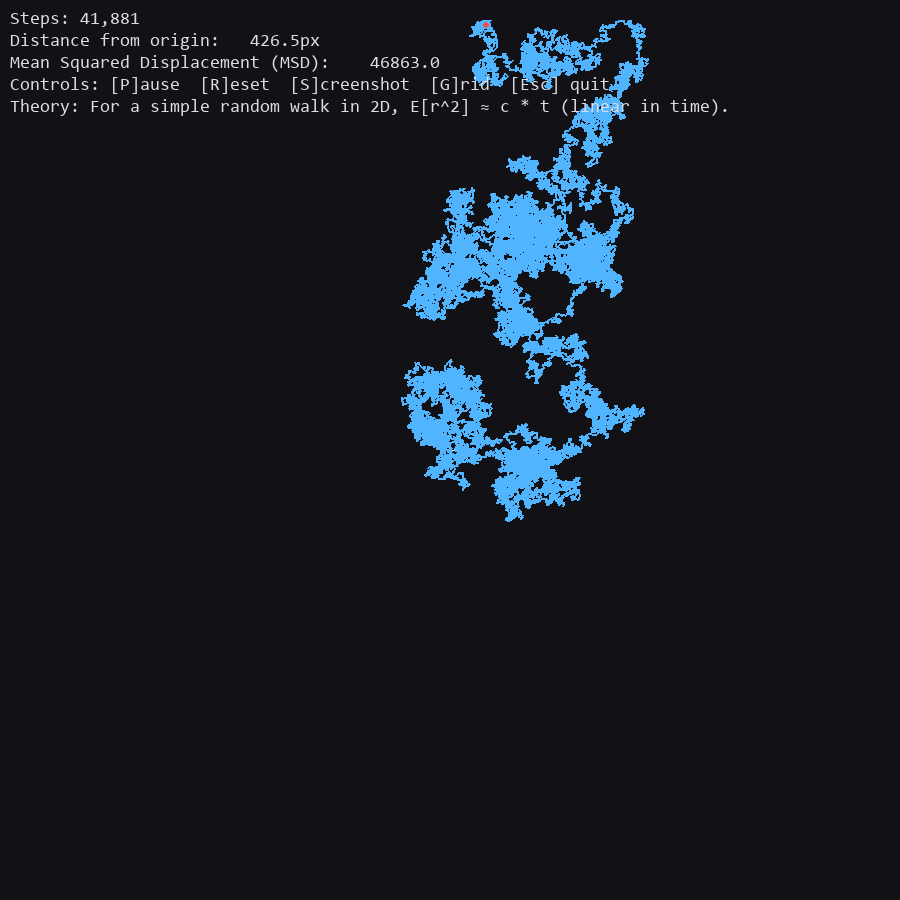

# Random Walk Simulation

This project is a simple visual demonstration of a random walk in two dimensions. A random walk is a path made up of a sequence of random steps. It is an important concept in probability and statistics because it models many real-world processes, such as the motion of particles in fluids, fluctuations in stock prices, and diffusion in physics.

In this program, a single dot starts at the center of the window and takes steps in random directions. Each step has the same length, but the direction is chosen at random. The path of the dot is drawn as a line, so you can see how the walk develops over time. The program also shows live statistics such as:

* The number of steps taken.
* The distance of the dot from the origin.
* The mean squared displacement (MSD), which is the average squared distance from the origin over all steps so far.

These statistics demonstrate how, over time, the mean squared displacement grows roughly in proportion to the number of steps. This reflects the basic mathematical property of a random walk: the average squared distance increases linearly with time.

---

### How to Run

1. Make sure you have Python installed (3.10 or newer is recommended).
2. Install Pygame if you don’t already have it:
   ```bash
   pip install pygame
   ```
3. Run the program:
   ```bash
   python random_walk.py
   ```

---

## Controls

While the program is running, you can use these keys:

* **P** : Pause or resume the random walk.
* **R** : Reset the walk and start over from the center.
* **S** : Save a screenshot of the current window as `random_walk_frame.png`.
* **G** : Toggle the background grid on or off.
* **Esc / Close** : Quit the program.

---

## Screenshot

Below is an example screenshot of the simulation in action. You can create your own by pressing **S** while the program is running.



---

## Why This is Interesting

Random walks are a simple but powerful concept. They show how randomness builds patterns over time. In two dimensions, the walk tends to spread out, but because the steps are random, the path looks tangled and unpredictable. This simulation makes that behavior visible and easy to understand.
